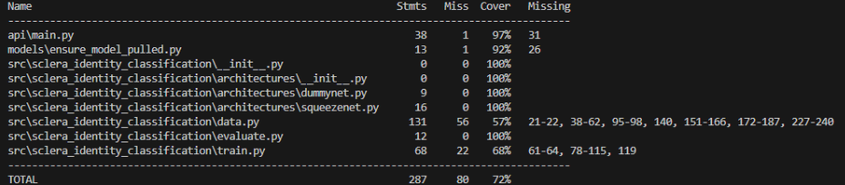
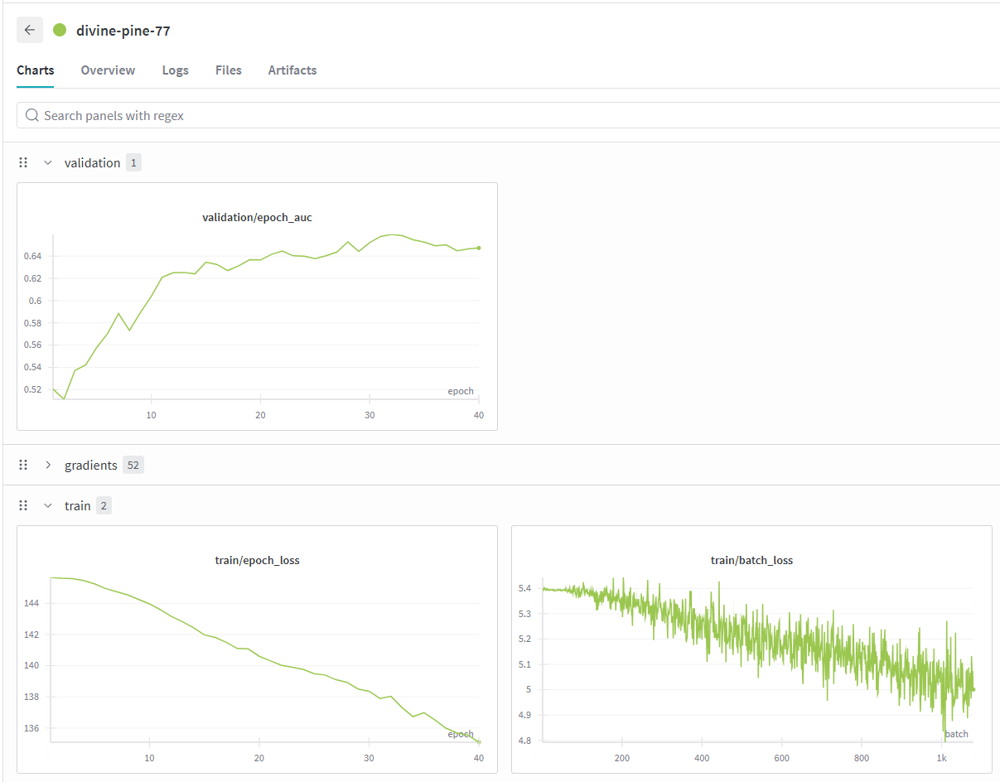
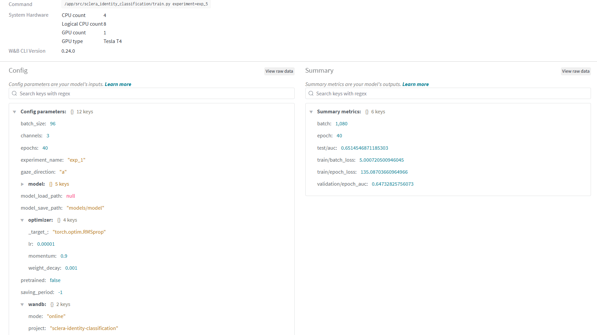
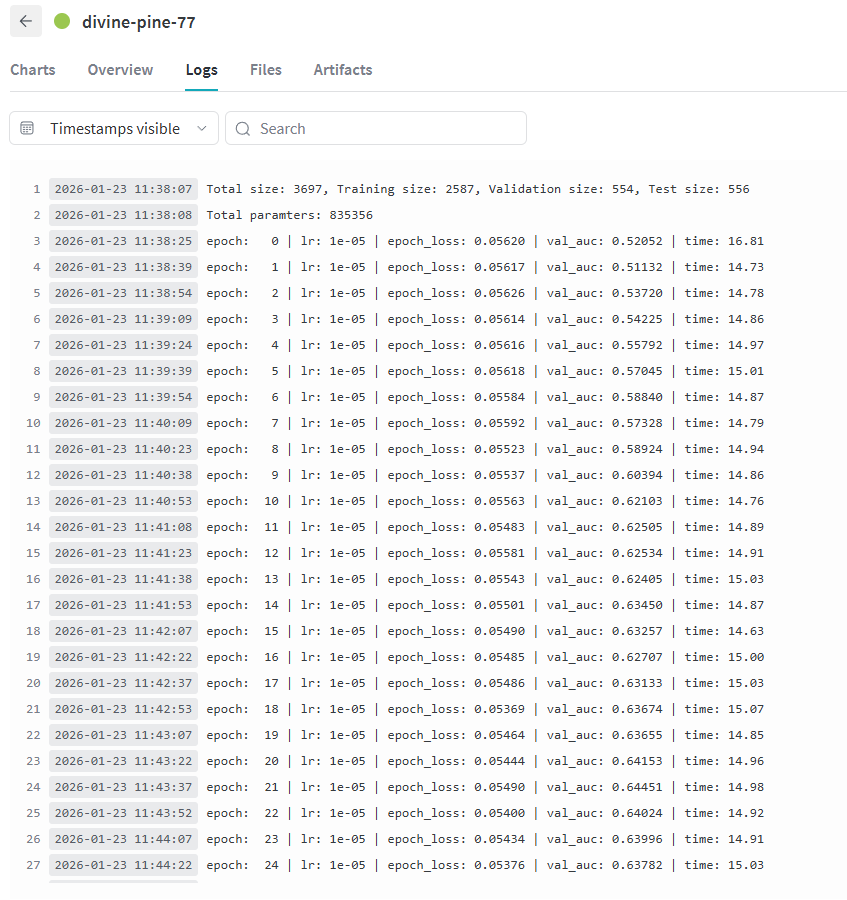
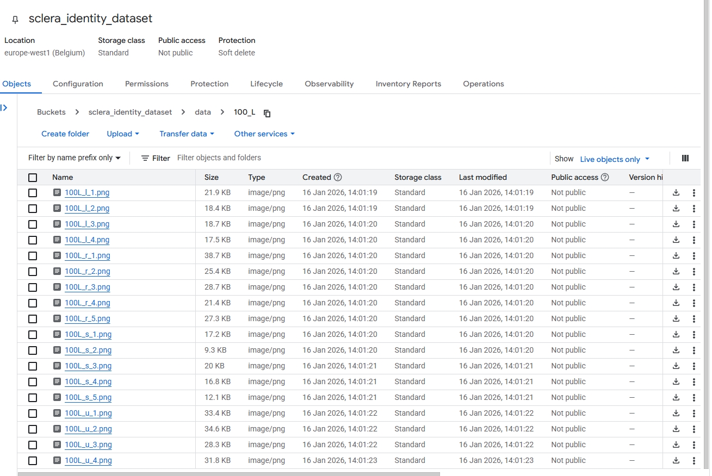
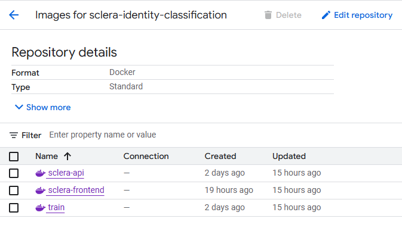
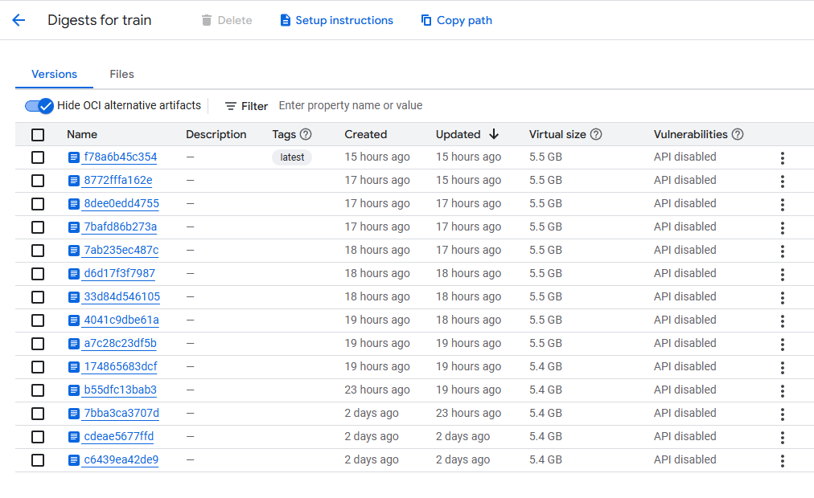
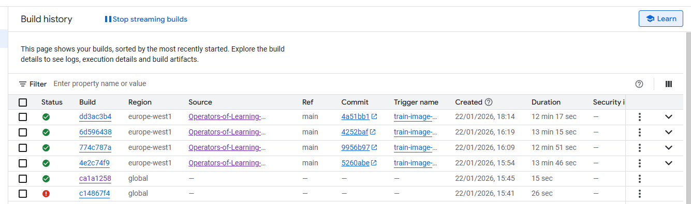
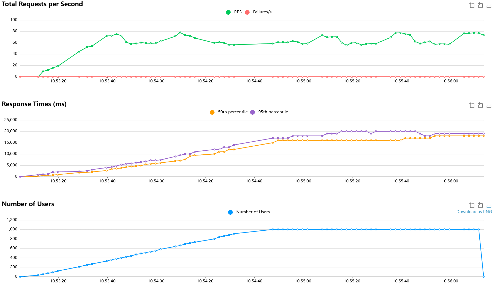
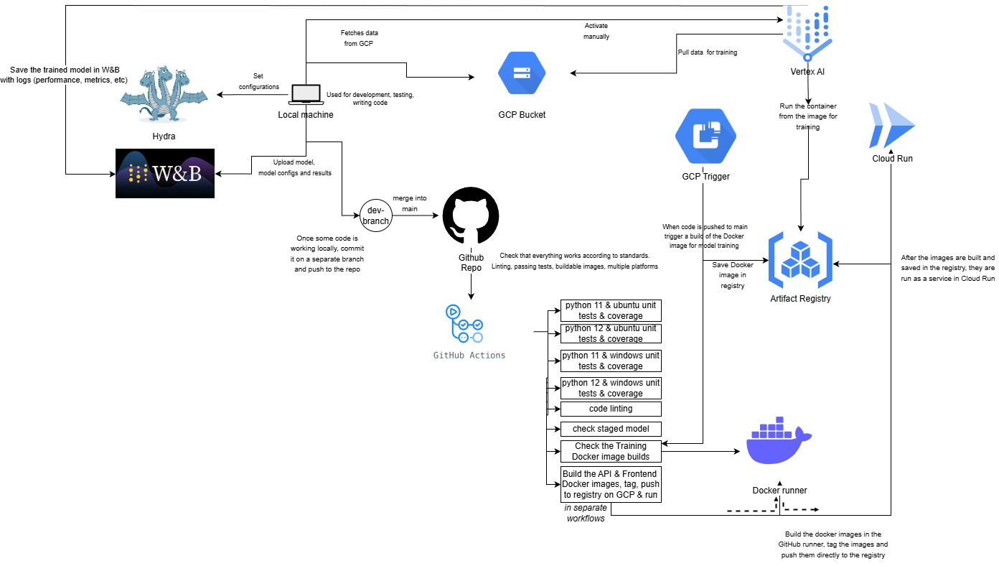

# Exam template for 02476 Machine Learning Operations

This is the report template for the exam. Please only remove the text formatted as with three dashes in front and behind
like:

```--- question 1 fill here ---```

Where you instead should add your answers. Any other changes may have unwanted consequences when your report is
auto-generated at the end of the course. For questions where you are asked to include images, start by adding the image
to the `figures` subfolder (please only use `.png`, `.jpg` or `.jpeg`) and then add the following code in your answer:

``

In addition to this markdown file, we also provide the `report.py` script that provides two utility functions:

Running:

```bash
python report.py html
```

Will generate a `.html` page of your report. After the deadline for answering this template, we will auto-scrape
everything in this `reports` folder and then use this utility to generate a `.html` page that will be your serve
as your final hand-in.

Running

```bash
python report.py check
```

Will check your answers in this template against the constraints listed for each question e.g. is your answer too
short, too long, or have you included an image when asked. For both functions to work you mustn't rename anything.
The script has two dependencies that can be installed with

```bash
pip install typer markdown
```

or

```bash
uv add typer markdown
```

## Overall project checklist

The checklist is *exhaustive* which means that it includes everything that you could do on the project included in the
curriculum in this course. Therefore, we do not expect at all that you have checked all boxes at the end of the project.
The parenthesis at the end indicates what module the bullet point is related to. Please be honest in your answers, we
will check the repositories and the code to verify your answers.

### Week 1

* [x] Create a git repository (M5)
* [x] Make sure that all team members have write access to the GitHub repository (M5)
* [x] Create a dedicated environment for you project to keep track of your packages (M2)
* [x] Create the initial file structure using cookiecutter with an appropriate template (M6)
* [x] Fill out the `data.py` file such that it downloads whatever data you need and preprocesses it (if necessary) (M6)
* [x] Add a model to `model.py` and a training procedure to `train.py` and get that running (M6)
* [x] Remember to either fill out the `requirements.txt`/`requirements_dev.txt` files or keeping your
    `pyproject.toml`/`uv.lock` up-to-date with whatever dependencies that you are using (M2+M6)
* [x] Remember to comply with good coding practices (`pep8`) while doing the project (M7)
* [x] Do a bit of code typing and remember to document essential parts of your code (M7)
* [ ] Setup version control for your data or part of your data (M8)
* [x] Add command line interfaces and project commands to your code where it makes sense (M9)
* [x] Construct one or multiple docker files for your code (M10)
* [x] Build the docker files locally and make sure they work as intended (M10)
* [x] Write one or multiple configurations files for your experiments (M11)
* [x] Used Hydra to load the configurations and manage your hyperparameters (M11)
* [ ] Use profiling to optimize your code (M12)
* [x] Use logging to log important events in your code (M14)
* [x] Use Weights & Biases to log training progress and other important metrics/artifacts in your code (M14)
* [ ] Consider running a hyperparameter optimization sweep (M14)
* [ ] Use PyTorch-lightning (if applicable) to reduce the amount of boilerplate in your code (M15)

### Week 2

* [x] Write unit tests related to the data part of your code (M16)
* [x] Write unit tests related to model construction and or model training (M16)
* [x] Calculate the code coverage (M16)
* [x] Get some continuous integration running on the GitHub repository (M17)
* [x] Add caching and multi-os/python/pytorch testing to your continuous integration (M17)
* [x] Add a linting step to your continuous integration (M17)
* [x] Add pre-commit hooks to your version control setup (M18)
* [ ] Add a continues workflow that triggers when data changes (M19)
* [x] Add a continues workflow that triggers when changes to the model registry is made (M19)
* [x] Create a data storage in GCP Bucket for your data and link this with your data version control setup (M21)
* [x] Create a trigger workflow for automatically building your docker images (M21)
* [x] Get your model training in GCP using either the Engine or Vertex AI (M21)
* [x] Create a FastAPI application that can do inference using your model (M22)
* [x] Deploy your model in GCP using either Functions or Run as the backend (M23)
* [x] Write API tests for your application and setup continues integration for these (M24)
* [x] Load test your application (M24)
* [x] Create a more specialized ML-deployment API using either ONNX or BentoML, or both (M25)
* [x] Create a frontend for your API (M26)

### Week 3

* [ ] Check how robust your model is towards data drifting (M27)
* [x] Setup collection of input-output data from your deployed application (M27)
* [ ] Deploy to the cloud a drift detection API (M27)
* [x] Instrument your API with a couple of system metrics (M28)
* [x] Setup cloud monitoring of your instrumented application (M28)
* [ ] Create one or more alert systems in GCP to alert you if your app is not behaving correctly (M28)
* [x] If applicable, optimize the performance of your data loading using distributed data loading (M29)
* [ ] If applicable, optimize the performance of your training pipeline by using distributed training (M30)
* [ ] Play around with quantization, compilation and pruning for you trained models to increase inference speed (M31)

### Extra

* [ ] Write some documentation for your application (M32)
* [ ] Publish the documentation to GitHub Pages (M32)
* [ ] Revisit your initial project description. Did the project turn out as you wanted?
* [x] Create an architectural diagram over your MLOps pipeline
* [x] Make sure all group members have an understanding about all parts of the project
* [x] Uploaded all your code to GitHub


## Group information


### Question 1
> **Enter the group number you signed up on <learn.inside.dtu.dk>**
>
> Answer:


67


### Question 2
> **Enter the study number for each member in the group**
>
> Answer:


 s200655, s243873, s253070, s254127


### Question 3
> **Did you end up using any open-source frameworks/packages not covered in the course during your project? If so**
> **which did you use and how did they help you complete the project?**
>
> Recommended answer length: 0-200 words.
>
> Answer:


We did not use any open-source frameworks or packages not covered in the course that greatly influenced our project. We only used the tools presented in the lectures and exercises.


## Coding environment


> In the following section we are interested in learning more about your local development environment. This includes
> how you managed dependencies, the structure of your code and how you managed code quality.


### Question 4


> **Explain how you managed dependencies in your project? Explain the process a new team member would have to go**
> **through to get an exact copy of your environment.**
>
> Recommended answer length: 100-200 words
>
> Answer:


We used `uv` as a package manager in our project. The list of dependencies can be seen in the `pyproject.toml` file in the root of our repo. 

To get a copy of the environment, after cloning the project, a new team member would need to run `uv sync`. To test that the code works, one would need to either run the tests, the api, or the training script. That can be done by running `uv run uvciron api.main:app --port 8000` from the root for example. We had a “dev” dependency group that was only used for development, these packages were not synced when running our code in the containers.


### Question 5


> **We expect that you initialized your project using the cookiecutter template. Explain the overall structure of your**
> **code. What did you fill out? Did you deviate from the template in some way?**
>
> Recommended answer length: 100-200 words
>
> Answer:


We did indeed use the cookiecutter template when initialising the project. 

Compared to the original template provided in the course, we have made some changes, additions and removals. 

We have a .devcontainer folder that can be used to develop in a virtual Docker container locally. We also have some folders generated by the tools we used such as ruff, wandb, etc. 

We have removed some unused folders like notebooks. 

There were some other minor changes in the folder structure. For example inside src we have another folder called sclera_identity_classification that contains our code. We have also added an /api folder for our api and a folder called /frontend.

Otherwise, the project’s structure is the same as the template. 
### Question 6


> **Did you implement any rules for code quality and format? What about typing and documentation? Additionally,**
> **explain with your own words why these concepts matters in larger projects.**
>
> Recommended answer length: 100-200 words.
>
> Answer:


For code linting we used `ruff`. This tool can be run locally, but we also have a workflow that runs this tool. We are notified about incorrect linting in out GitHub actions. We tried to use typing in our project where possible, and most of our method parameters are properly typed. We did not document our code extensively, as this project was rather small and spanned a short period of time, and the team members are aware of which parts are working and how.
In larger projects, however, these details are important to maintain the code quality from the readability and functionality perspective. The documentation aspect is important when onboarding new members on the team and to quickly remember what some sections of the code do.


## Version control


> In the following section we are interested in how version control was used in your project during development to
> corporate and increase the quality of your code.


### Question 7


> **How many tests did you implement and what are they testing in your code?**
>
> Recommended answer length: 50-100 words.


> Answer:


In total we have implemented 10 tests spread over the api endpoints, model initialization, data loading and formatting, as well as model training.
Overall we primarily tested critical parts of the code such as data formatting and model training, as well as error points for file upload to the api inference endpoint.


### Question 8


> **What is the total code coverage (in percentage) of your code? If your code had a code coverage of 100% (or close**
> **to), would you still trust it to be error free? Explain you reasoning.**
>
> Recommended answer length: 100-200 words.
>
> Answer:


Our total code coverage is 72%, which indicates that a substantial portion of the codebase is exercised by automated tests. While this level of coverage helps increase confidence in the stability of core functionality, it does not guarantee that the system is error-free. Code coverage measures which lines of code are executed during testing, but it does not assess whether the tests correctly verify expected behavior or catch logical errors. Even with 100% coverage, tests may miss edge cases, incorrect assumptions, or integration issues, especially in systems involving external dependencies such as model loading. Additionally, a line of code can be executed without being meaningfully validated by assertions. Therefore, while high coverage is useful as an indicator of test completeness, it must be complemented by well-designed test cases, careful validation of edge conditions, and manual review.





### Question 9


> **Did you workflow include using branches and pull requests? If yes, explain how. If not, explain how branches and**
> **pull request can help improve version control.**
>
> Recommended answer length: 100-200 words.
>
> Answer:


We had a feature branching strategy. On GitHub, we created Issues from the Weekly checkmarks for the project. Each issue would have at least one branch. Pull requests were utilized to merge those branches back into the main branch which were, most of the time, reviewed by at least one other team member. On every pull request, we had the following workflows:
- Code linting with ruff
- Running the Unit tests on Windows, Ubuntu and Python version 3.12 and 3.11
- Building a Docker image for the training script


If any of them did not pass, the person responsible for the task would first fix all the workflow issues before another team member would complete the pull request.


GitHub was also configured so that after a successful merge with a pull request, it would delete the branch that it merged from and close the Issue that was connected to it, maintaining the Issues overview seamlessly.

### Question 10


> **Did you use DVC for managing data in your project? If yes, then how did it improve your project to have version**
> **control of your data. If no, explain a case where it would be beneficial to have version control of your data.**
>
> Recommended answer length: 100-200 words.
>
> Answer:


We did not use DVC as our data would not change throughout the entire project - it was therefore marked as a low priority task. We already had a stable set of images with which to train, validate and test. 

It would be useful for reproducibility of our model training runs if we had multiple versions of the data. On another note, if the data was too large to push with the repository, it would be useful to have just a reference to the data in the cloud and simply connect to a remote storage. We did end up storing out data in cloud and pulling it from there.


### Question 11


> **Discuss you continuous integration setup. What kind of continuous integration are you running (unittesting,**
> **linting, etc.)? Do you test multiple operating systems, Python  version etc. Do you make use of caching? Feel free**
> **to insert a link to one of your GitHub actions workflow.**
>
> Recommended answer length: 200-300 words.
>
> Answer:


Our continuous integration makes sure that our code can run on multiple platforms and with different python versions. We check for python version 3.11 and 3.12 and that it runs on Ubuntu and Windows.
It also checks that the unit tests in our test/ folder run successfully on these platforms. We also check that the staged model works. 
Our workflows may be slow though, because we also make sure that the data in the container is present. As we do not commit our `data` folder to git, every time a new container runs, we pull the data from GCP buckets to make sure it is there (for training or testing for example). 
In the workflows we also check that the API and the training containers build. And we push the API container to the GCP Artifact Registry and start it up in the Cloud Run service. There is also a trigger set up on GCP that on a push to the main branch creates a image for training the model in the Artifact Registry.    


## Running code and tracking experiments


> In the following section we are interested in learning more about the experimental setup for running your code and
> especially the reproducibility of your experiments.


### Question 12


> **How did you configure experiments? Did you make use of config files? Explain with coding examples of how you would**
> **run a experiment.**
>
> Recommended answer length: 50-100 words.
>
> Answer:


We used `hydra` and config files to manage experiments. We have one `default_config.yaml` file, that keeps track of other configs we have for the model, optimizer, experiment type, and wandb parameters. We have different experiment configs in the configs/experiment/ folder. To run different experiments for training the model, one can either run


`uv run invoke train --experiment=exp_1`


Or


`uv run .\src\sclera_identity_classification\train.py experiment=exp_1`


From the root of the project.
### Question 13


> **Reproducibility of experiments are important. Related to the last question, how did you secure that no information**
> **is lost when running experiments and that your experiments are reproducible?**
>
> Recommended answer length: 100-200 words.
>
> Answer:


As stated in the previous answer, we made use of config files to ensure that experiments are reproducible in terms of parameters that are used during training. When the training is run, the `uv` command is given an `experiment` parameter, that makes sure that the parameters are taken from the correct exp_{number} file in the configs.


To reproduce an experiment, one would have to run mention command:


`uv run invoke train --experiment=exp_1`


And make sure that they do it in the same environment (preferably in a Docker container with a provided image). There is a dockerfile for training that is set up to use the correct dependencies and image.


To build the Docker image, one would need to run this command:


`docker build -f .\dockerfiles\train.dockerfile  -t sclera-train:gpu .`


And to run it, this one:


`docker run --rm --gpus all --shm-size=2g `
  -e WANDB_API_KEY=you_api_key `
  -v "${PWD}\sclera-trainer.key.json:/secrets/gcp.key.json:ro" `
  -e GOOGLE_APPLICATION_CREDENTIALS=/secrets/gcp.key.json `
  sclera-train:gpu
`
Notice that the WANDB_API_KEY is required and that the person has the proper secret present to authenticate with the gcp.


### Question 14


> **Upload 1 to 3 screenshots that show the experiments that you have done in W&B (or another experiment tracking**
> **service of your choice). This may include loss graphs, logged images, hyperparameter sweeps etc. You can take**
> **inspiration from [this figure](figures/wandb.png). Explain what metrics you are tracking and why they are**
> **important.**
>
> Recommended answer length: 200-300 words + 1 to 3 screenshots.
>
> Answer:




The first figure contains charts from a training run. We track AUC for every validation epoch and loss for every train epoch and batch. The validation and train metrics are split into separate dropdowns for future additions of more possible metrics. We also store gradients.




All the metrics from the previous figures have their final value stored as a summary metric. The page also shows the hyperparameters used from the configuration file input for training.




Some important information during training is logged in the Logs tab as well, although most of it can be found in the charts too.


We can use these metrics to potentially find issues with some hyperparameters. Loss changing very slowly can indicate too low of a learning rate, high training metrics can indicate overfitting etc. We can more easily spot errors in our training.


### Question 15


> **Docker is an important tool for creating containerized applications. Explain how you used docker in your**
> **experiments/project? Include how you would run your docker images and include a link to one of your docker files.**
>
> Recommended answer length: 100-200 words.
>
> Answer:


We used Docker from the very start. It was used to run the experiments for training on the same environment only changing the parameters given in the configurations. But we also used Docker for the API and the Frontend applications.


To build the Docker image for the training, one would need to run this command:


`docker build -f .\dockerfiles\train.dockerfile  -t sclera-train:gpu .`


And to run it, this one:


`docker run --rm --gpus all --shm-size=2g `
  -e WANDB_API_KEY=you_api_key `
  -v "${PWD}\sclera-trainer.key.json:/secrets/gcp.key.json:ro" `
  -e GOOGLE_APPLICATION_CREDENTIALS=/secrets/gcp.key.json `
  sclera-train:gpu\
  experiment=exp_{number}
`
With the appropriate environment variables and the present `sclera-trainer.key.json` that contains the key to connect to GCP. This is needed to fetch the data from there, as the containers are loaded without the data. To run different experiments in Docker, one would need to choose an experiment number in the command. 
The README.md file in the root contains the information on how to get that file if needed, but the user needs to have an account in the GCP project.

This is the link to the training Dockerfile: https://github.com/Operators-of-Learning-Machines/mlops_final_project/blob/main/dockerfiles/train.dockerfile


### Question 16


> **When running into bugs while trying to run your experiments, how did you perform debugging? Additionally, did you**
> **try to profile your code or do you think it is already perfect?**
>
> Recommended answer length: 100-200 words.
>
> Answer:


Debugging was highly dependent on each group member and their specific approach they were used to. We mostly read the error messages from the terminal, be it from the local terminal in VS Code or the Logs available on GCP, when using any of their services. We tried using pair-coding when possible, whihc means that two or three group memebrs tried to develop a feature or solve an issues. This was quite beneficial as it allowed using the knowledge and expertise of each group memebr. 
In general, we did not prioritize adding any profiling to our project for code optimization.


## Working in the cloud


> In the following section we would like to know more about your experience when developing in the cloud.


### Question 17


> **List all the GCP services that you made use of in your project and shortly explain what each service does?**
>
> Recommended answer length: 50-200 words.
>
> Answer:


During our project we used the following services:


**Bucket** is used for storing our data (images with labels). In our training code and in the associated tests, there is a check if the /data folder is present, and if not, then the data is fetched from the Bucket. This is done so that we don’t push our data to GitHub. The Buckets are also used when logging the requests + responses in the api. So when the /sclera_model endpoint is accessed with an image and the inference is done, both the input and the output is logged in Bucket. 


**Artifact Registry** was used for storing the Docker images for training, the API and the frontend. For the api and the frontend, the images are built in GitHub runner and pushed to the **Artifact Registry**. For training, the image is built in the **Artifact Registry** through a trigger that gets activated on pushes to main. 


**Cloud Run** was used to run the containers for the the API and the frontend as services. This way, we make sure that these two applications are working and can be accessed from the browser. 


**Vertex AI** was used to run the training containers as a custom job. Once it finishes running, the model with all the training + evaluation metrics is stored in WanDB. 


### Question 18


> **The backbone of GCP is the Compute engine. Explained how you made use of this service and what type of VMs**
> **you used?**
>
> Recommended answer length: 100-200 words.
>
>
> Answer:


We did not make direct use of Compute Engine or manually managed virtual machines during our project. Instead, all compute resources were accessed through higher-level managed services. The API and frontend were deployed using Cloud Run, which abstracts away VM management and automatically provisions and scales Compute Engine instances as needed.
For model training, we used Vertex AI custom training jobs, where the underlying compute (including GPU-enabled virtual machines) is managed by GCP. This allowed us to run containerized training workloads without configuring VM instances, networking, or scaling manually.


### Question 19


> **Insert 1-2 images of your GCP bucket, such that we can see what data you have stored in it.**
> **You can take inspiration from [this figure](figures/bucket.png).**
>
> Answer:


 - the data used for training, validation, and testing.

 - logs of input+output in the Bucket. 


### Question 20


> **Upload 1-2 images of your GCP artifact registry, such that we can see the different docker images that you have**
> **stored. You can take inspiration from [this figure](figures/registry.png).**
>
> Answer:




Here we store our 3 images for the api, frontend and the training script.




The figure above shows the history of previous images for the training script.


### Question 21


> **Upload 1-2 images of your GCP cloud build history, so we can see the history of the images that have been build in**
> **your project. You can take inspiration from [this figure](figures/build.png).**
>
> Answer:




The figure shows the building of a training image that is triggered by pushing code to the main branch on GitHub.


### Question 22


> **Did you manage to train your model in the cloud using either the Engine or Vertex AI? If yes, explain how you did**
> **it. If not, describe why.**
>
> Recommended answer length: 100-200 words.
>
> Answer:


We managed to train our model using Vertex AI. Firstly, there is a trigger waiting for a push to the main branch on our GitHub repository which creates a train Docker image from the files relevant for training of our model. This image is then pushed to an Artifact Registry on GCP. In the configs/vertex folder, there are yaml files configuring the Vertex AI service containing the Wand API key to log the important metrics and the experiment yaml file that should be used for configuring the hyperparameters for the model training. Finally, we run `gcloud builds submit . --config=configs/vertex/vertex_train.yaml` locally to trigger the model training. At the moment, it has to be triggered manually with the command. It will use the experiment file that is specified in configs/vertex/config_gpu.yaml under the args property. This file can be quickly changed and the gcloud command can be run right after for many training containers with different config file setups.


## Deployment


### Question 23


> **Did you manage to write an API for your model? If yes, explain how you did it and if you did anything special. If**
> **not, explain how you would do it.**
>
> Recommended answer length: 100-200 words.
>
> Answer:


We did manage to build an API for our model. We used FastAPI for quick development. The api has 3 endpoints in total


/ - test endpoint of the “Hello World” type

/metrics - provided by the prometheus package and used for monitoring the api

/sclera_model - the endpoint used for inference. Accepts Files (images of a specific size). There are checks to make sure that only images are accepted and that they are of the correct size. This endpoint then calls the model for inference and outputs a flattened distribution of probabilities as an array of floats. Several metrics are logged here as well - total calls to inference, failed calls, and successful calls.


Our model is also wrapped with ONNX, so the api makes sure that both the model and the ONNX wrapper of it exist.


### Question 24


> **Did you manage to deploy your API, either in locally or cloud? If not, describe why. If yes, describe how and**
> **preferably how you invoke your deployed service?**
>
> Recommended answer length: 100-200 words.
>
>
> Answer:


We did manage to deploy our API to the cloud. It is running as a service in Cloud Run. We have a Dockerfile intended for building the api image. When we merge something into main on Github, the image is built in the runner, tagged, and pushed to the Artifact Registry. In the same Github action, the Cloud Run gets the command to run that image.


When developing, we also check that the api runs and that it can be dockerized and can be run.


Here is the url to the .yaml file that takes care of it: https://github.com/Operators-of-Learning-Machines/mlops_final_project/blob/main/.github/workflows/api-docker-build-push.yaml

To make api calls, a user should send requests to https://sclera-api-611901019822.europe-west1.run.app.


### Question 25


> **Did you perform any unit testing and load testing of your API? If yes, explain how you did it and what results for**
> **the load testing did you get. If not, explain how you would do it.**
>
> Recommended answer length: 100-200 words.
>
> Answer:

For the api unit tests we used Pytest and FastAPI’s TestClient. The unit tests were used to both test the home / root endpoint and more importantly the post endpoint for image upload and model inference. It also tested a couple of error points such as uploading an incorrect file format and uploading a “too large” file.

We also performed load tests of the API. The setup for the load tests were setting the wait_time to send requests every second, and then having 1000 users connect with a spawn rate of 10 new users per second. The results from the load tests:



The results show that it is able to handle requests at a relatively low user count, but as the number of users increases so does the load on the service, which impacts both endpoints. To better adhere to this load some setup changes would have to be made to the gcloud and how it distributes a large amount of incoming requests.


### Question 26


> **Did you manage to implement monitoring of your deployed model? If yes, explain how it works. If not, explain how**
> **monitoring would help the longevity of your application.**
>
> Recommended answer length: 100-200 words.
>
> Answer:


We did manage to implement monitoring of our API using Prometheus. We are using simple counters to track how many requests are passed to the endpoints. We count the number of requests made to the root, to the inference api, and how many calls to the inference were successful and how many failed.


It is important to note that the /metrics endpoint will only show the results per container, and not for all the deployed containers. In general, this helps with seeing how many requests are made to the endpoints, if it’s used, and maybe what parts of the app need more attention.


Not directly related to metrics or monitoring, but we also log the inference inputs and outputs in buckets. This could be used later for analyzing the model’s accuracy (although we already have wandb for this).

## Overall discussion of project


> In the following section we would like you to think about the general structure of your project.


### Question 27


> **How many credits did you end up using during the project and what service was most expensive? In general what do**
> **you think about working in the cloud?**
>
> Recommended answer length: 100-200 words.
>
> Answer:


We ended up using around 3 USD$ (a bit was used during the exercises) for the cloud tools mentioned in Question 17. The resources that required the most money are:


Compute Engine - 1.66USD

Artifact Registry - 0.58USD

Vertex AI - 0.37USD

Cloud Storage - 0.32USD


I think that working in the cloud may be hard to get used to in the beginning, but it becomes an environment that is easy to understand and operate in time. There are a lot of useful tools for deploying and managing applications.


### Question 28


> **Did you implement anything extra in your project that is not covered by other questions? Maybe you implemented**
> **a frontend for your API, use extra version control features, a drift detection service, a kubernetes cluster etc.**
> **If yes, explain what you did and why.**
>
> Recommended answer length: 0-200 words.
>
>
> Answer:


We implemented a simple frontend application using streamlit. It works by having the user input an segmented image of a sclera and then classifying it and showing the probability distribution.


### Question 29


> **Include a figure that describes the overall architecture of your system and what services that you make use of.**
> **You can take inspiration from [this figure](figures/overview.png). Additionally, in your own words, explain the**
> **overall steps in figure.**
>
> Recommended answer length: 200-400 words
>
> Example:
>
> Answer:

We initially experimented with a VS Code Dev Container for local development but ultimately dropped it due to compatibility issues across our machines. Instead, we developed locally and set up GitHub workflows that trigger whenever a pull request is merged into the main branch. Before any merge is allowed, a full suite of unit and integration tests is executed.

We also added workflows that build Docker images for both the API and the frontend using a Docker runner, push them to Artifact Registry, and deploy them via Cloud Run.

For data storage, we rely on Cloud Storage buckets to store both our dataset and user input logs.

In addition, we experimented with Cloud Triggers to automatically build training images, which are then used to train models on Vertex AI. After training completes, we log both results and model weights to Weights & Biases.

To manage and run different experiments, we use Hydra.



### Question 30


> **Discuss the overall struggles of the project. Where did you spend most time and what did you do to overcome these**
> **challenges?**
>
> Recommended answer length: 200-400 words.
>
> Answer:


Some of the biggest struggles were in the beginning when figuring out how to work with dev containers.

Later, we had to figure out how to make sure that all the tests pass on different operating systems and with different python versions.

We had some issues when writing tests for the api and making sure that they pass.

We have also spent a lot of time discussing how exactly to solve specific exercises or parts of the project. For example we struggled a bit with how we should in the end connect the api with the deployed model and how do we make sure that the api is connected to the latest version of the model. Then there was the issue of deploying the frontend application and making sure that it can connect to the deployed api. 


### Question 31


> **State the individual contributions of each team member. This is required information from DTU, because we need to**
> **make sure all members contributed actively to the project. Additionally, state if/how you have used generative AI**
> **tools in your project.**
>
> Recommended answer length: 50-300 words.
> Answer:


Student s254127 was in charge of:
- Setting up the initial cookie cutter project
- Creating the GitHub Organization and Repository
- Creating Issues from the Week checkmarks and configuring GitHub for easy creation of branches and auto-closing Issues on merges for an overview of the project progress
- Setting up a trigger for a training Docker Image in the Artifact Registry on GCP and training of the model on Vertex AI Service from it
- Adding pre-commit hooks to the git setup
- Assisting with proper metrics logging in Wandb


Student s243873 was in charge of:
- Making sure the Docker image for training is successfully building and running locally.
- Setting up Wandb, making sure that the model and its metrics are logged there and that it is well integrated with the existing training code (including hydra parameters).
- Adding command-line interfaces for running the training and building Docker images with `uv run invoke …`
- Writing the Dockerfile for training and making sure the container connects to Wandb and GCP Buckets.
- Making sure the continuous integrations works, that tests pass on different operating systems with different python versions, that the docker images can be built, etc.
- Creating the data storage in GCP Buckets
- Making sure that the docker image for the api is successfully builds and pushed to the Artifact Registry and that it runs properly in Cloud Run.
- Integrating ONNX to add separation between the model and the inference.
- Setting up the collection of input-output.
- Setting up monitoring of system metrics with Prometheus.
- Creating the architecture diagram of the project.


Student s253070 was in charge of:
- Implementing unit tests for both data preprocessing and model construction/training, and ensuring adequate test coverage.
- Setting up and reporting code coverage as part of the continuous integration workflow.
- Containerizing the project components using Docker and ensuring reproducible local and cloud builds.
- Deploying the trained model to Google Cloud Platform using Cloud Run as the backend service.
- Implementing a continuous workflow that automatically triggers when updates are made to the model registry.
- Completing the data ingestion and preprocessing pipeline (data.py) to download and prepare the required datasets.
- Contributing to general project maintenance by closing Week 1 and Week 2 milestone tasks and ensuring compliance with course requirements.


Student s200655 was in charge of:
- Implement unit tests for the api
- Conduct load tests
- Generate the configuration files for experiment reproducibility using Hydra
- Implement the api endpoints
- Setting up the docker image for the api
- Adding the api tests to the continuous integration tests in Github


We used ChatGPT and Gemini for:
- Generating small pseudocode snippets and adapting it to our cases
- Helping with identification of bugs for their faster resolution
- Clarifying terminology and topics from the MLOps course
- We also used GitHub Copilot for easier and faster code implementation.
